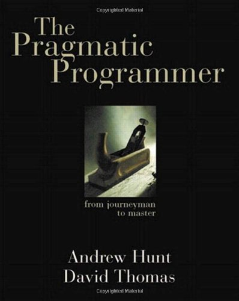

# Introduction to 

# 
 *The Pragmatic Programmer*

---

# The Pragmatic Programmer

published in 1999

---

# About the authors

*Andy Hunt* (sometimes credited as Andrew Hunt) is a writer of books on software development. Hunt co-authored The Pragmatic Programmer, six other books and many articles, and was one of the 17 original authors of the Agile Manifesto and founders of the Agile Alliance. He and partner Dave Thomas founded the Pragmatic Bookshelf series of books for software developers.

From <http://en.wikipedia.org/wiki/Andy_Hunt_(author)>

*Dave Thomas* is a computer programmer and author/editor. He has written about Ruby. Together with Andy Hunt, he co-authored The Pragmatic Programmer and runs The Pragmatic Bookshelf publishing company. Dave Thomas lives north of Dallas, Texas. He moved to the United States from England in 1994.

From <http://en.wikipedia.org/wiki/Dave_Thomas_(programmer)>

----

# my comments

*	comprehensive
*	detailed
*	on all aspects of software engineering

----

# Preface

a Pragmatic Programmer

*	Early adopter/fast adapter
*	Inquisitive
*	Critical thinker
*	Realistic
*	Jack of all trades

tips

*	Care About Your Craft
*	Think! About Your Work

----

# Chapter 1. A Pragmatic Philosophy

tips

*	Provide Options, Don't Make Lame Excuses
*	Don't Live with Broken Windows
*	Be a Catalyst for Change
*	Remember the Big Picture
*	Make Quality a Requirements Issue

		Building Your Portfolio

		*	Invest regularly
		*	Diversify
		*	Manage risk
		*	Buy low, sell high
		*	Review and rebalance

*	Invest Regularly in Your Knowledge Portfolio
*	Critically Analyze What You Read and Hear
*	It's Both What You Say and the Way You Say It

		E-Mail Communication
		
		*	Proofread before you hit SEND.
		*	Check the spelling.
		*	Keep the format simple.
		*	Use rich-text or HTML formatted mail only if you know that all your recipients can read it. Plain text is universal.
		*	Try to keep quoting to a minimum.
		*	If you're quoting other people's e-mail, be sure to attribute it, and quote it inline (rather than as an attachment).
		*	Don't flame unless you want it to come back and haunt you later.
		*	Check your list of recipients before sending.
		*	Archive and organize your e-mail–both the import stuff you receive and the mail you send.
		
----

# Chapter 2. A Pragmatic Approach

tips

*	DRY—Don't Repeat Yourself

		duplication categories:
		
		*	Imposed
		*	Inadvertent
		*	Impatient
		*	Interdeveloper
		
		techniques:
		
		*	Multiple representations of information.
		*	Documentation in code.
		*	Documentation and code.
		*	Language issues.

*	Make It Easy to Reuse
*	Eliminate Effects Between Unrelated Things

		techniques to maintain orthogonality:
		
		*	Keep your code decoupled.
		*	Avoid global data.
		*	Avoid similar functions.
		
*	There Are No Final Decisions
*	Use Tracer Bullets to Find the Target

		Prototyping is a learning experience.
		
*	Prototype to Learn
*	Program Close to the Problem domain
*	Estimate to Avoid Surprises
*	Iterate the Schedule with the Code

----

# Chapter 3. The Basic Tools

tips

*	Keep Knowledge in Plain Text

		The Unix Philosophy
		
*	Use the Power of Command Shells
*	Use a Single Editor Well
*	Always Use Source Code Control
*	Fix the Problem, Not the Blame
*	Don't Panic
*	"select" Isn't Broken
*	Don't Assume It—Prove It
*	Learn a Text Manipulation Language
*	Write Code That Writes Code

----

# Chapter 4. Pragmatic Paranoia

tips

*	You Can't Write Perfect Software
*	Design with Contracts
*	Crash Early
*	If It Can't Happen, Use Assertions to Ensure That It Won't
*	Use Exceptions for Exceptional Problems
*	Finish What You Start

----

# Chapter 5. Bend or Break

tips

*	Minimize Coupling Between Modules
*	Configure, Don't Integrate
*	Put Abstractions in Code Details in Metadata
*	Analyze Workflow to Improve Concurrency
*	Design Using Services
*	Always Design for Concurrency

		The CORBA Event Service
		
*	Separate Views from Models
*	Use Blackboards to Coordinate Workflow

----

# Chapter 6. While You Are Coding

tips

*	Don't Program by Coincidence
*	Estimate the Order of Your Algorithms
*	Test Your Estimates
*	Refactor Early, Refactor Often
*	Design to Test
*	Test Your Software, or Your Users Will
*	Don't Use Wizard Code You Don't Understand

----

# Chapter 7. Before the Project

		Requirements rarely lie on the surface. Normally, they're buried deep beneath layers of assumptions, misconceptions, and politics.
		
tip

*	Don't Gather Requirements—Dig for Them
*	Work with a User to Think Like a User
*	Abstractions Live Longer than Details

		The key to managing growth of requirements is to point out each new feature's impact on the schedule to the project sponsors.
		
*	Use a Project Glossary
*	Don't Think Outside the Box—Find the Box
*	Listen to Nagging Doubts—Start When You're Ready
*	Some Things Are Better Done than Described
*	Don't Be a Slave to Formal Methods
*	Expensive Too Do Not Produce Better Designs

----

# Chapter 8. Pragmatic Projects

tips

*	Organize Around Functionality, Not Job Functions
*	Don't Use Manual Procedures
*	Coding Ain't Done 'Til All the Tests Run
*	Treat English as Just Another Programming Language
*	Build Documentation In, Don't Bolt It On

		The Linux documentation project uses DocBook to publish information in RTF, TeX, info, PostScript, and HTML formats.

*	Use Saboteurs to Test Your Testing
*	Test State Coverage, Not Code Coverage
*	Find Bugs Once
*	Gently Exceed Your Users' Expectations
*	Sign Your Work

----

# Appendix A. Resources

----