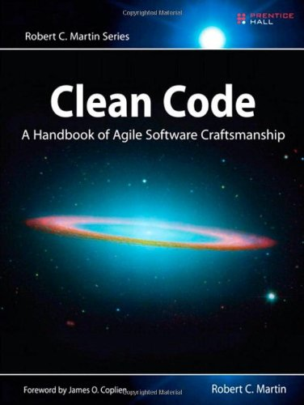

# Introduction to 

# 
 *Clean Code*

---

# Clean Code

published in 2008

---

# About the author

*Robert Cecil Martin*, known colloquially as "Uncle Bob", is an American software consultant and author. Martin has been a software professional since 1970 and an international software consultant since 1990. In 2001, he initiated the meeting of the group that created agile software development from extreme programming techniques. He is also a leading member of the software craftsmanship movement. His video "code casts" on the Clean Coders website can be purchased on www.cleancoders.com. He founded Object Mentor Inc., a consulting firm that specializes in training their clients in C++, Java, OOP, patterns, UML, agile methodologies, and extreme programming. From 1996 to 1999 he was the editor-in-chief of the C++ Report. In 2002 he wrote Agile Software Development: Principles, Patterns, and Practices, which gives pragmatic advice on object-oriented design and development in an agile team.

From <http://en.wikipedia.org/wiki/Robert_Cecil_Martin>

----

# Foreword

----

# Introduction

----

# 1 Clean Code

*	There Will Be Code
*	Bad Code
*	The Total Cost of Owning a Mess
*	The Grand Redesign in the Sky
*	Attitude
*	The Primal Conundrum
*	The Art of Clean Code?
*	What Is Clean Code?

	-	Bjarne Stroustrup, inventor of C++ and author of The C++ Programming Language
	-	Grady Booch, author of Object Oriented Analysis and Design with Applications
	-	“Big” Dave Thomas, founder of OTI, godfather of the Eclipse strategy
	-	Michael Feathers, author of Working Effectively with Legacy Code
	-	Ron Jeffries, author of Extreme Programming Installed and Extreme Programming Adventures in C#
	-	Ward Cunningham, inventor of Wiki, inventor of Fit, coinventor of eXtreme Programming. 
	
*	Schools of Thought
*	We Are Authors
*	The Boy Scout Rule
*	Prequel and Principles
*	Conclusion

----

# 2 Meaningful Names

*	Introduction
*	Use Intention-Revealing Names
*	Avoid Disinformation
*	Make Meaningful Distinctions
*	Use Pronounceable Names
*	Use Searchable Names
*	Avoid Encodings
*	Hungarian Notation
*	Member Prefixes
*	Interfaces and Implementations
*	Avoid Mental Mapping
*	Class Names
*	Method Names
*	Don’t Be Cute
*	Pick One Word per Concept
*	Don’t Pun
*	Use Solution Domain Names
*	Use Problem Domain Names
*	Add Meaningful Context
*	Don’t Add Gratuitous Context
*	Final Words

----

# 3 Functions

*	Small!
*	Blocks and Indenting
*	Do One Thing
*	Sections within Functions
*	One Level of Abstraction per Function
*	Reading Code from Top to Bottom: The Stepdown Rule
*	Switch Statements

		Single Responsibility Principle (SRP) 
		
		http://en.wikipedia.org/wiki/Single_responsibility_principle 
		http://www.objectmentor.com/resources/articles/srp.pdf
		
		Open Closed Principle (OCP)
		
		http://en.wikipedia.org/wiki/Open/closed_principle
		http://www.objectmentor.com/resources/articles/ocp.pdf

*	Use Descriptive Names
*	Function Arguments
*	Common Monadic Forms
*	Flag Arguments
*	Dyadic Functions
*	Triads
*	Argument Objects
*	Argument Lists
*	Verbs and Keywords
*	Have No Side Effects
*	Output Arguments
*	Command Query Separation
*	Prefer Exceptions to Returning Error Codes
*	Extract Try/Catch Blocks
*	Error Handling Is One Thing
*	The Error.java Dependency Magnet
*	Don’t Repeat Yourself
*	Structured Programming
*	How Do You Write Functions Like This?
*	Conclusion

----