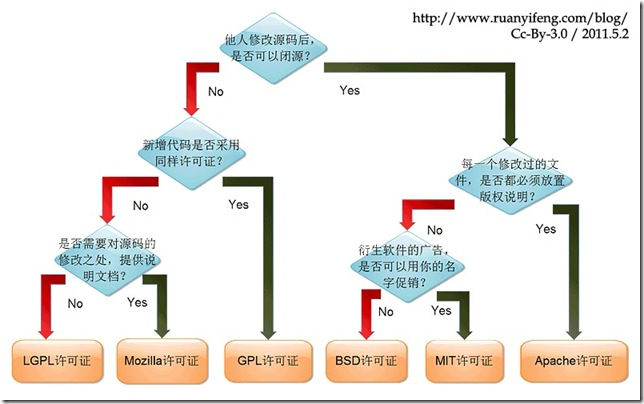

# Introduction to Embedded Linux Development

Chapter 1 is required, the rest is optional.

# Questions and Discussions

* what are the differences between the the Linux kernel running on a desktop system and an embedded Linux kernel?

* A Linux platform vs. A Linux distribution

* “embedded Linux distribution” vs. desktop/server Linux distributions

* “toolchain” and “cross-compilers”

* GNU Compiler Collection (GCC)

	LLVM, Clang
	GNU C Library (glibc)
	
* other C libraries

* Boot Loaders

	bootloaders are often specific to the computer architecture on a specific system.
	
- GRUB

- Syslinux

- Das U-Boot

* Kernel configuration

- Device Drivers

* filesystem

- RAM-based

- storage-based

-flash-based

* Linux System Initialization and Startup Process

* three basic types of libraries

- static

- shared

- dynamically loaded

* Starting Application(s) at Boot Time

* Licenses

	
